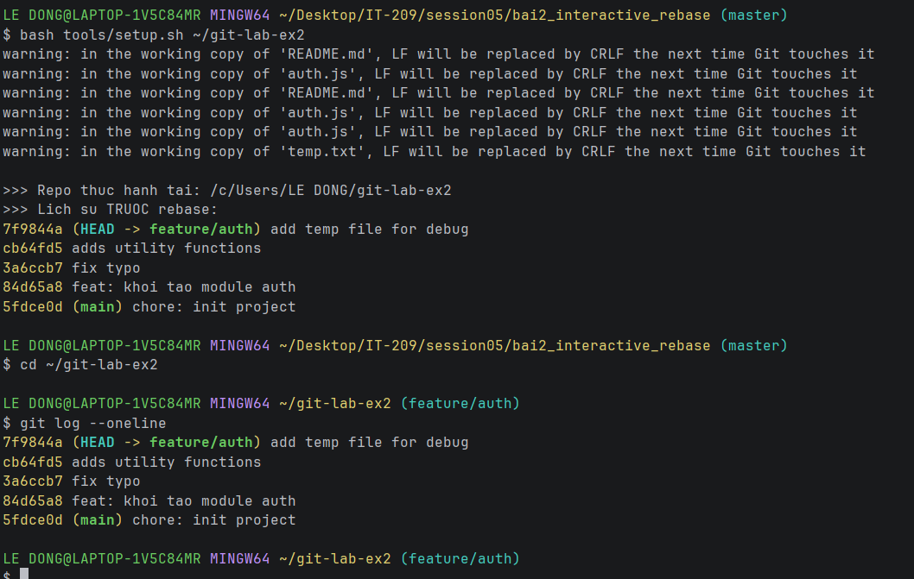
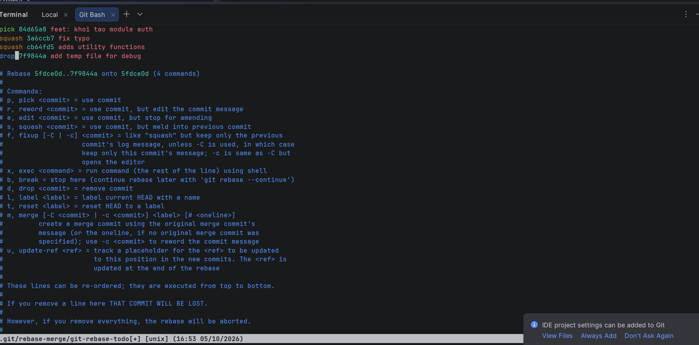
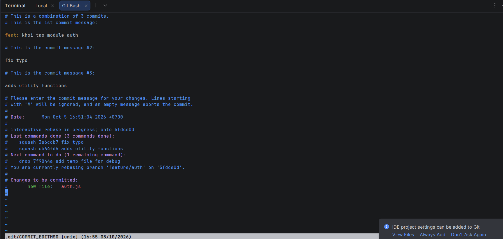
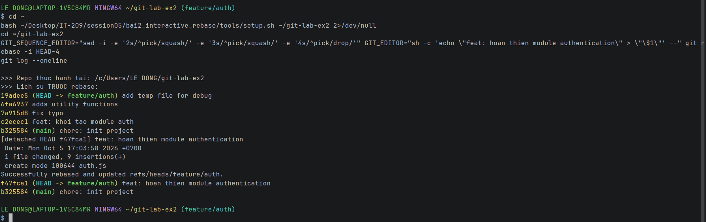

# Bài 2: Tái cấu trúc lịch sử commit bằng Interactive Rebase

- **Họ tên:** Lê Trung Đông
- **GitHub:** ptitvn
- **Nhánh làm việc:** `feature/auth`

## 1. Lịch sử commit TRƯỚC khi rebase

Lệnh: `git log --oneline`

```text
7f9844a (HEAD -> feature/auth) add temp file for debug
cb64fd5 adds utility functions
3a6ccb7 fix typo
84d65a8 feat: khoi tao module auth
5fdce0d (main) chore: init project
```



## 2. Giao diện Interactive Rebase (pick / squash / drop)

Lệnh: `git rebase -i HEAD~4`

```text
pick   84d65a8 feat: khoi tao module auth
squash 3a6ccb7 fix typo
squash cb64fd5 adds utility functions
drop   7f9844a add temp file for debug
```



## 3. Giao diện soạn thông điệp commit gộp (reword)

Sau khi squash, Git mở editor để soạn lại thông điệp cho commit gộp (3 commit). Thông điệp được đặt thành:

`feat: hoan thien module authentication`



> Ghi chú: ảnh ở mục 2 và 3 chụp ở một lần thực hành; lần chạy cuối (ảnh mục 4) dựng lại repo nên mã hash khác, nội dung các bước hoàn toàn giống nhau.

## 4. Lịch sử commit SAU khi rebase

Lệnh: `git log --oneline`

```text
f47fca1 (HEAD -> feature/auth) feat: hoan thien module authentication
b325584 (main) chore: init project
```



Chỉ còn đúng 1 commit đại diện cho tính năng trên nhánh `feature/auth` (commit `b325584` là commit nền của `main`).

## 5. Nhận xét

- 3 commit nhỏ (`feat: khoi tao module auth`, `fix typo`, `adds utility functions`) được gộp thành 1 bằng `squash`.
- Commit chứa `temp.txt` bị loại bỏ bằng `drop`, file rác không còn trong lịch sử.
- Thông điệp commit cuối: `feat: hoan thien module authentication`.
